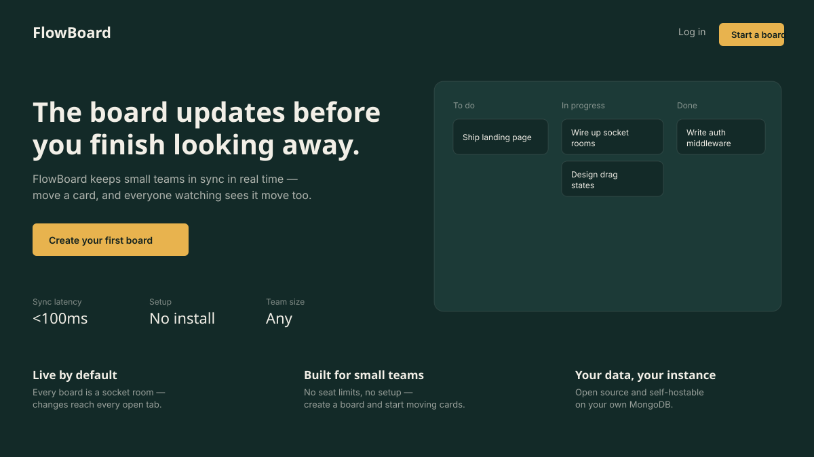
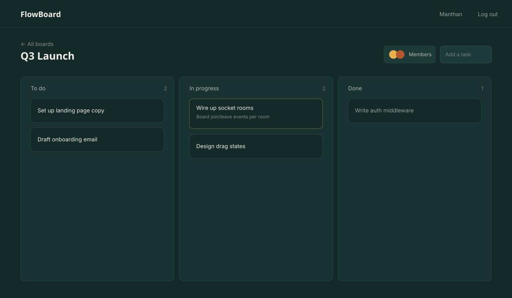

# FlowBoard

A real-time collaborative task board built with the MERN stack. Move a card and every open tab
watching that board updates instantly via Socket.IO — no refresh needed.




> These are designed previews built from the app's actual color/type tokens, not live screenshots —
> this repo was built in a sandboxed environment with no browser available to capture real ones.
> Swap them for the real thing in under a minute:
> ```bash
> cd backend && npm run dev &
> cd frontend && npm run dev
> ```
> Open `http://localhost:5173`, screenshot the landing page and a board with a few tasks on it,
> and replace `assets/preview-landing.svg` / `assets/preview-board.svg` (update the extension and
> the `![...]` lines above if you swap to `.png`).

## Stack

- **Backend:** Node.js, Express, MongoDB (Mongoose), Socket.IO, JWT auth, bcrypt
- **Frontend:** React (Vite), Tailwind CSS, Framer Motion, React Router, Axios, socket.io-client

## Features

- Email/password auth with JWT
- Create boards, add/remove tasks
- Drag-and-drop tasks between To do / In progress / Done
- Task detail view — click a card to edit its title and description
- Invite existing FlowBoard users to a board by email; owner can remove members
- Real-time sync across all clients viewing the same board (Socket.IO rooms) — task edits and
  member changes both broadcast live
- Animated, deliberately-designed landing page (not a template default)

## Running locally

### Backend

```bash
cd backend
cp .env.example .env   # fill in MONGO_URI and JWT_SECRET
npm install
npm run dev             # requires nodemon, or use: npm start
```

### Frontend

```bash
cd frontend
npm install
npm run dev
```

The frontend dev server proxies `/api` to `http://localhost:5000` (see `vite.config.js`), so run
the backend first.

## What's next / not yet built

- Invites currently require the invitee to already have a FlowBoard account (no email-based
  invite-to-signup flow yet)
- Deployment config (Docker/Render/Railway for backend, Vercel/Netlify for frontend)
- Tests

## Project structure

```
flowboard/
  backend/
    config/       # MongoDB connection
    models/       # User, Board (embedded Task schema)
    controllers/   # auth + board logic, emits socket events on writes
    routes/
    middleware/   # JWT auth guard
    socket/       # socket.io room join/leave handlers
    server.js
  frontend/
    src/
      pages/      # Landing, Login, Register, Dashboard, BoardView
      components/ # Navbar, Column, TaskCard, CreateBoardModal
      context/    # AuthContext
      lib/        # axios instance, socket client
```
